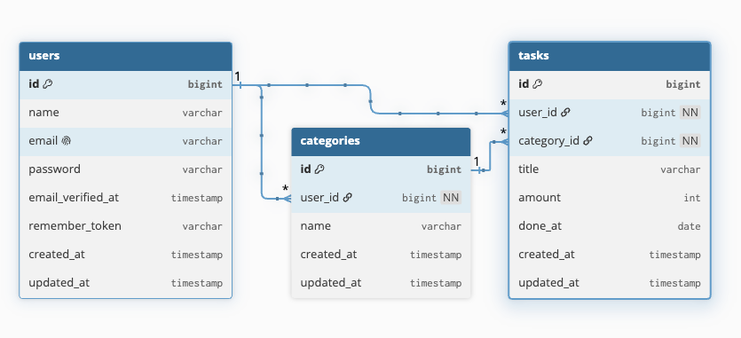
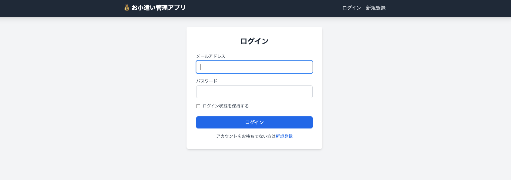
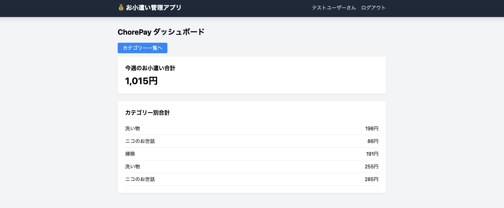
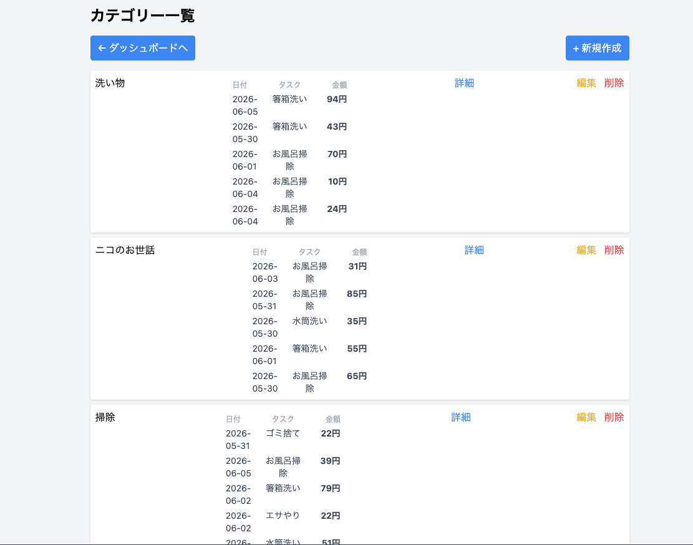
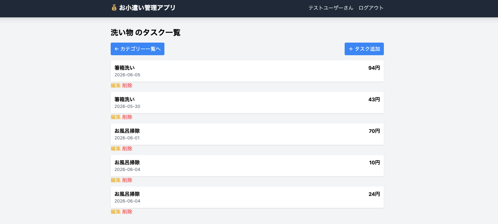

# ChorePay

子どものお手伝いをお小遣いとして管理するWebアプリです。

カテゴリーごとにお手伝い内容を登録し、獲得したお小遣いを集計できます。

---

# URL

※ デプロイ後に記載予定

---

# 制作背景

子どものお手伝いを給料制のように管理したいと考えたことがきっかけです。

お手伝いの内容ごとに金額を設定し、どの作業でいくら獲得したかを記録できるアプリとして開発しました。

---

# 主な機能

- ユーザー登録
- ログイン / ログアウト
- カテゴリー管理
- タスク管理
- 週次集計
- カテゴリー別集計
- バリデーション
- Policyによる認可
- Factory / Seeder

---

# 使用技術

| 項目            | 技術                  |
| --------------- | --------------------- |
| Backend         | Laravel 10            |
| Frontend        | Blade / Tailwind CSS  |
| Authentication  | Laravel Fortify       |
| Database        | MySQL                 |
| Environment     | Docker (Laravel Sail) |
| Version Control | Git / GitHub          |

---

# ER図



---

# 画面一覧

## ログイン画面



### 機能

- ログイン
- 新規登録画面への遷移

---

## ダッシュボード

今週のお小遣い合計とカテゴリー別集計を確認できます。



### 機能

- 今週のお小遣い合計表示
- カテゴリー別合計表示
- カテゴリー一覧画面への遷移

---

## カテゴリー一覧

カテゴリーの作成・編集・削除を行えます。



### 機能

- カテゴリー作成
- カテゴリー編集
- カテゴリー削除
- タスク一覧画面への遷移

---

## タスク一覧

お手伝い内容と金額を管理できます。



### 機能

- タスク作成
- タスク編集
- タスク削除

---

# データベース設計

## users

| カラム名 | 型      |
| -------- | ------- |
| id       | bigint  |
| name     | varchar |
| email    | varchar |
| password | varchar |

---

## categories

| カラム名 | 型      |
| -------- | ------- |
| id       | bigint  |
| user_id  | bigint  |
| name     | varchar |

---

## tasks

| カラム名    | 型      |
| ----------- | ------- |
| id          | bigint  |
| user_id     | bigint  |
| category_id | bigint  |
| title       | varchar |
| amount      | int     |
| done_at     | date    |

---

# 工夫した点

- ユーザーごとにデータを分離するためPolicyを導入
- ダッシュボードで週次集計・カテゴリー別集計を実装
- Factory / Seederにより開発環境を即時再現可能
- 画面遷移を整理し、URL直接入力なしで操作可能に改善

---

# 今後の改善予定

- Feature Test実装
- 月間集計機能
- ランキング機能
- UI改善
- デプロイ対応

---

# 環境構築

## 1. リポジトリをクローンする

GitHub上のソースコードをローカル環境にコピーします。

```bash
git clone <repository-url>
```

```bash
cd chorePay-app
```

---

## 2. 環境変数ファイルを作成する

Laravelの環境設定ファイルを作成します。

```bash
cp .env.example .env
```

---

## 3. Composerパッケージをインストールする

Laravelで必要なPHPパッケージをインストールします。

```bash
composer install
```

---

## 4. Dockerコンテナを起動する

Laravel Sailを使用して開発環境を起動します。

```bash
./vendor/bin/sail up -d
```

---

## 5. アプリケーションキーを生成する

Laravelで使用する暗号化キーを生成します。

```bash
./vendor/bin/sail artisan key:generate
```

---

## 6. データベースを作成する

マイグレーションを実行してテーブルを作成します。

```bash
./vendor/bin/sail artisan migrate
```

---

## 7. ダミーデータを投入する

Seederを実行して開発用データを作成します。

```bash
./vendor/bin/sail artisan db:seed
```

---

## 8. マイグレーションとSeederをまとめて実行する場合

既存データを削除し、テーブル作成とダミーデータ投入をまとめて実行します。

```bash
./vendor/bin/sail artisan migrate:fresh --seed
```

---

## 9. フロントエンド環境を構築する

必要なNode.jsパッケージをインストールします。

```bash
npm install
```

---

## 10. フロントエンドを起動する

Tailwind CSS・Viteを起動します。

```bash
npm run dev
```

---

## 11. アプリへアクセスする

ブラウザで以下のURLへアクセスしてください。

```text
http://localhost
```

---

# テストユーザー

Seeder実行後は以下のアカウントでログインできます。

```text
メールアドレス: test@example.com
パスワード: password
```

---
